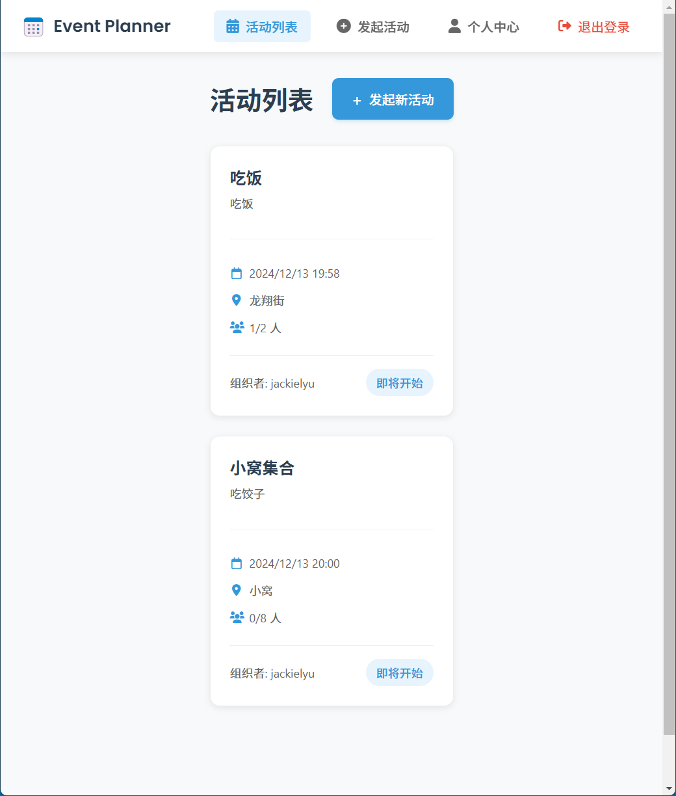

# 活动管理系统

一个用于创建和管理活动的全栈应用程序。用户可以注册账号、创建活动、查看活动详情并管理个人资料。

## 应用截图




## 技术栈

前端使用 React + TypeScript 开发，后端采用 Node.js + Express 构建。

## 开始使用

1. 克隆项目 
```
git clone git@github.com:may3rr/geziwang.git
```

2. 安装依赖
```
# 前端依赖
npm install

# 后端依赖
cd server
npm install
```

3. 环境配置
```
# 复制并配置环境变量
cp .env.example .env
cd server && cp .env.example .env
```

4. 启动开发环境
```
# 启动前端（默认端口3000）
npm start

# 新开一个终端，启动后端（默认端口5000）
cd server
npm run dev
```

## 项目结构

```
├── src/                # 前端源代码
│   ├── components/     # React组件
│   ├── App.tsx        # 主应用组件
│   └── App.css        # 全局样式
├── server/            # 后端源代码
│   ├── src/
│   │   ├── routes/    # API路由
│   │   ├── models/    # 数据模型
│   │   └── middleware/# 中间件
│   └── index.ts       # 服务器入口
└── README.md
```

## 主要功能

- 用户系统：注册、登录、个人资料管理
- 活动管理：创建活动、查看活动列表、活动详情
- 权限控制：基于 JWT 的用户认证


## 部署说明

1. 构建前端
```
npm run build
```

2. 构建后端
```
cd server
npm run build
```

3. 生产环境启动
```
cd server
npm start
```

## 许可证

MIT

